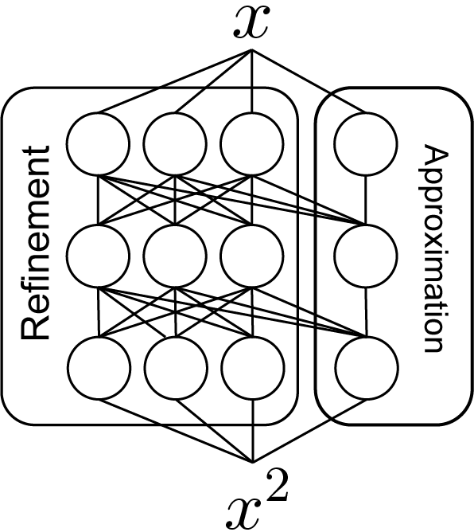
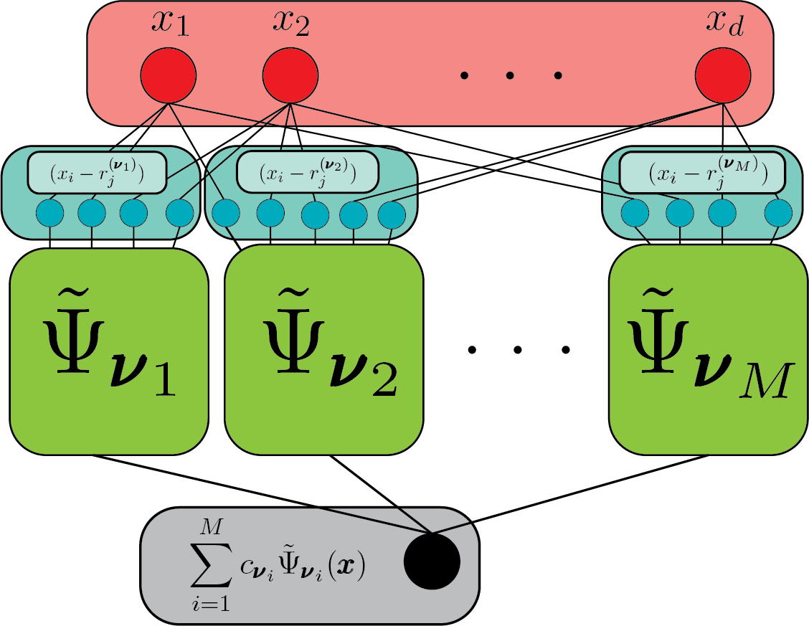
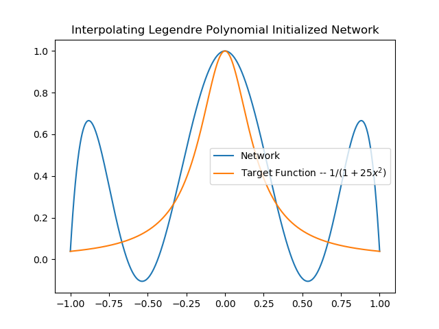
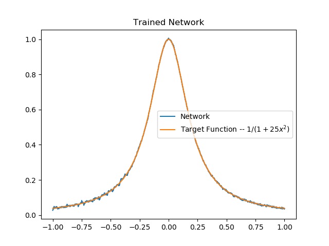
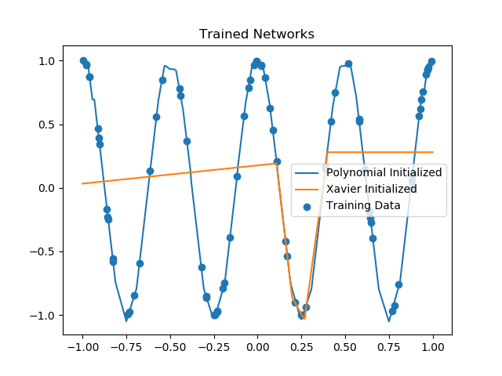

+++
title = "Polynomial Inspired Neural Network Design and Initiailzation"
date = 2019-05-14T11:36:57-05:00
draft = false

# Authors. Comma separated list, e.g. `["Bob Smith", "David Jones"]`.
authors = ["Joseph Daws"]

# Tags and categories
# For example, use `tags = []` for no tags, or the form `tags = ["A Tag", "Another Tag"]` for one or more tags.
tags = ["neural-networks","network-architecture","machine-learning"]
categories = ["Neural-Networks"]

# Featured image
# To use, add an image named `featured.jpg/png` to your page's folder. 
[image]
  # Caption (optional)
  caption = ""

  # Focal point (optional)
  # Options: Smart, Center, TopLeft, Top, TopRight, Left, Right, BottomLeft, Bottom, BottomRight
  focal_point = ""
+++

# Polynomial approximation can inform network design
The following is a breif discussion of work found in this [preprint](https://arxiv.org/abs/1905.10457)
which has been submitted to NeurIPS 2019. In this post I've left out
many details. If you are interested in these details please see the 
preprint. As described in my previous 
[post](https://joedaws.github.io/post/designing-neural-networks/ "Neural Network Design")
Neural networks have emerged as a very powerful tool for constructing
nonlinear functions in high-dimensions. They are known to be very expressive
in the sense that the class of functions they can approximate is very wide. 
However, in order to cosntruct an approximation of a given function 
a very large number of network parameters must be determined.
This is espcially true for Deep Neural Networks (DNNs).
Because DNNs have many parameters and because the functions 
assocaited with solving tasks like image classification 
many be quite complicated, training can be very difficult.
Although many aspects of neural network are new (such as fast training algorithms
implementable on a GPU) their expressive power and ability to appoximate
has been known for decades. However, there do not seem to be 
many works which make explicit connections between the powerful 
results of classical approximation theory to expressibility results for
neural networks. Below is an outline of one way in which polynomial approximation
may inform efficient approximation of complicated functions by networks.
The primary connection between these kinds of approximation is made by
by constructing a network which can approximate a given polynomial. 
One can then take advantage of existing polynomial approximate results
by first finding a suitable polynomial approximation then constructing a network
which achieves this approximation. After it has been initialzed to behave 
like a polynomial, the network can be trained. Our numerical examples show that 
networks initialized by our proposed method have 
better performance than the polynomial used to initialize them. 

## A Network for Approximating Polynomials
Polynomials are natural objects of interest in many different areas of mathematics. 
A generic degree $n$ polynomial $P\_n$ is often written 
$$ P\_n(x) = a\_0 + a\_1 x + a\_2 x^2 + \cdots + a\_n x^n. $$
Written in this way the polynomial $P\_n$ is completely characterized
by its coefficients $a\_i$ for $i=0,...,n$. 
Therefore, finding a suitable polynomial approximation is equivalent to 
identifying coefficients. Instead of writing the polynomial
as a sum of the powers of the input $x$ one may also write a 
polynomial as the product of linear shifts of the input.
According to the __Fundamental Theorem of Algebra__
every degree $n$ polynomial can be written
$$P\_n(x) = a\Pi\_{i=1}^n (x - r\_i)$$
for $n$ complex numbers $r\_i$ and where $a$ is a scaling factor.
We construct a network which approximates $d$-dimensional
generalizations of polynomials like $P$ by approximating the product
of $n$ numbers with a network. Such a network can be constructed
by simplying chaining together several instances of a network
which approximates the product of two numbers.
Noticing that for two real numbers $a$ and $b$
$$ 2ab = (a+b)^2 -a^2 - b^2$$, we can approximate a product by
a linear combination of the outputs of three networks. One
which approximtes $(a+b)^2$, one which approximates $a^2$ and
one which approximates $b^2$. A network which approximtaes the mapping
$x \mapsto x^2$ can be constructed from an $L$ layer network
with $4$ nodes per level.

Chaining several of these networks together we can approximate 
the product of $n$ numbers and hence a polynomial. The following is
a rough outline the structure of network which approximates a polynomial.

## Initialization based on polynomials

It is possible to initialize a network to have polynomial behavior. 
Below, we have initiailzed network to a degree 6 Legendre interpolant
of a rational function.

This network can then be trained to achieve a good approximation of the target
rational polynomial. 

There are some recovery artifacts around the edges of the rational function. 
We believe these are due to the fact that we did not allow 
connections to form between the interior nodes of subnetworks which
approximate $x^2$. We can alieve these effects by using a simple 
polynomial $x^2$ to initialize a network.

Above we compare the result of trianing the same network initialized by our method to
the popular Xavier random initiailzation. We see that our network was better able to
approximate the target, at least for this example.

In the future, we plan to explore using this initialization scheme in real-world
problems of interest such as classificaiton.

