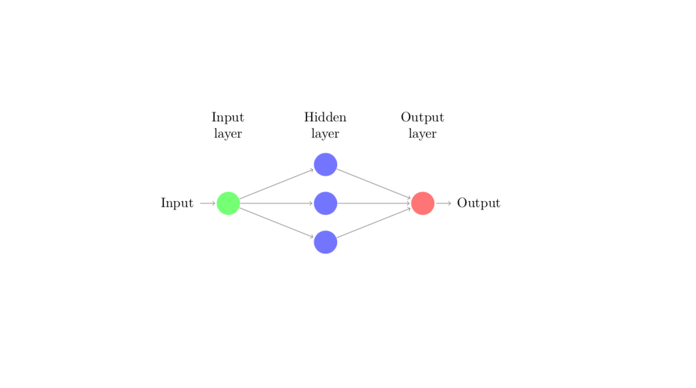

+++
title = "Designing Neural Networks"
date = 2018-11-07T15:23:38-05:00
draft = false

# Authors. Comma separated list, e.g. `["Bob Smith", "David Jones"]`.
authors = ["Joseph Daws"]

# Tags and categories
# For example, use `tags = []` for no tags, or the form `tags = ["A Tag", "Another Tag"]` for one or more tags.
tags = ["machine-learning","neural-networks"]
categories = ["Neural-Networks"]

# Featured image
# To use, add an image named `featured.jpg/png` to your page's folder. 
[image]
  # Caption (optional)
  caption = "A single layer artificial neural network"

  # Focal point (optional)
  # Options: Smart, Center, TopLeft, Top, TopRight, Left, Right, BottomLeft, Bottom, BottomRight
  focal_point = "Center"
+++

# Towards a mathematical understanding of using neural networks for function approximaiton.

> An artificial neural network (ANN) is a computational framework 
inspired by the interactions of neurons in the brain. 

Recently many difficult problems have been effectively solved using 
algorithms and mathematical models which iteratively improve their 
performance based on data rather than explicitly finding a solution.
Such methods, which primarily rely on data rather than explicit solution
techniques, can be grouped together under the umbrella of __Machine Learning__.
The field of machine learning is rapidly exanding and new results often
draw on a diverse background of mathematical, statistical, and even physics based
methods. However, many of its most dramatic successes involve neural networks. 
Some examples I find interesting are:

+ [Image Classification](http://www.cs.toronto.edu/~fritz/absps/ncfast.pdf)
  -- A neural network is trained to classify handwritten numbers using a 
  dataset of pre-labelled images of handwritten numbers. It is even able
  to classify images of digits not contained in the training set
+ [Artificial intelligence](https://www.nature.com/articles/nature24270)
  -- Move predicition and selection for the game Go by a neural network. 
  This network was able to beat a top level human player.
+ [Reinforced Learning](https://blog.openai.com/learning-dexterity/)
  -- A robtic hand controlled by a neural network is trained to manipulate 
  a cube to requested positions. The network uses data from a camera to 
  assess the current state of the cube and choose actions for the hand to 
  perform in order to rotate it to a desired position.

All three of these examples employ a neural network to solve a complex problem.

There are many fundamental theoretical questions that reamined
(partially) unanswered about ANN's, e.g.,

+ All networks require some training, a process by which pairs of inputs and outputs 
  are used to set the internal parameters of the model. A popular strategy for Training 
  is accomplished by stochastic gradient descent 
  [(SDG)](https://en.wikipedia.org/wiki/Stochastic_gradient_descent). 
  The convergence of this optimization problem is not well 
  quantified or well understood.
+ Given a network with a particular architecture, how does one determine 
  the class of functions it can express? 
  Moreover, even if optimal parameters can be shown to exist, are they easy to learn?
+ Under what conditions will a network generalize well to inputs and 
  outputs not contained in the training set? Some networks experience 
  very bad overfitting and do not make good predictions for new incoming data.

In order to make sense of any of these theoretical considerations 
in a mathematical context it is useful to characterize ANN's as both 
functions and graphs.
In this post we will consider designing a network to approximate a 
given analytic function $f$.
As a function, the network can be interpreted as a mapping from $\mathbb{R}^d$ to 
$\mathbb{R}^k$ where $d$ is the number of inputs to the network and 
$k$ is the number of ouputs. Let 
$$u\_{NN}:\mathbb{R}^d \rightarrow \mathbb{R}^k$$
be the functional interpretation of the neural network approximating an
analytic function $u$. The function $u\_{NN}$ is computed by a 
combinging a series computations performed
by constituent functions. The interactions between the constituent
functions that make up the network can be described by a
[directed acylic graph](https://en.wikipedia.org/wiki/Directed_acyclic_graph).
The associated graph can be used to analyze the complexity of the
network defined as the number of trainable parameters.

Simply put, a neural network can be characterized as a function consisting of
compositions and linear combinations of constituent functions called
__neurons__ which perform a computation of the form
$$ \sigma \left( \sum\_{i=1}^k w\_i \cdot x\_i  + b \right).$$

+ $x\_i$ -- The __inputs__ for the computation. 
  They could be the result of computations performed by other neurons or
  raw input.
+ $w\_i$ -- The __weight__ associated to the incoming data $x\_i$.
+ $\sigma$ -- A nonlinear function called the __activation function__.
+ $b$ -- A number called the __bias__ of the neuron.

## Nonlinear functions and graphs
Below is a simple example showing the dual characterization 
of a single hidden layer ANN. 

*A single hidden layer network with three neurons.*

This graph depicts how each of the constituent computations are used 
to form the final output of th network. Here we call the function 
induced by the network $f$. The function $f$ maps the input $x$ 
to the output $f(x)$ and is computed as a linear combination of 
the computations performed in the hidden layer.
One can also write $f$ in a way more easily recognized as a funciton.
 

*The network as a function.*

This representation makes explicit the mapping how $f$ maps the input
$x$ to the output $f(x)$. It also shows how the mapping induced
by the network depends entirely on the choice of the weights, biases and
the activiation function. Choosing these parameters directly determines
how well the network $f$ performs its task. 

Suppose that we wish to design a network for function approximation,
i.e., one is tasked to chose the parameters of $f$ so that it
produces the same input--output pairs as a function 
$g:\mathbb{R} \rightarrow \mathbb{R}$. 
The problem of finding an optimal approximation of $g$ is then finding 
the optimal parameters for $f$ so that the quantity $error$ is as small
as possible where
$$ error = ||f - g||$$
for an appropriately chosen norm $|| \cdot ||$. 
Notice that the approximation power of $f$ also depends on the choice of 
$\sigma$. It is possible to consider $\sigma$ as a parameter, but there are 
several established choices for $\sigma$ that are widely used, see e.g.
[activation functions](https://en.wikipedia.org/wiki/Activation_function).
Here I will consider using the so called Rectified Linear Unit (ReLU)
activation function.

*The ReLU actication function is a piecewise linear function.*

The network $f$ is a very simple network and in practice shallow networks
have been shown have limited usage. In fact, it is known that deep networks, i.e.
networks with more than one hidden layer, are more expressive than 
shallow in the sense that they require less complex structure in order to 
express a given funciton. See the work of 
[Mhaskar](https://pdfs.semanticscholar.org/694a
/d455c119c0d07036792b80abbf5488a9a4ca.pdf). 

## The architecture of a network depends on its application

In practice, the design of neural networks is linked to their 
desired application. For instance, neural networks used for image
classification typically involve 
[convolutional kernels](https://en.wikipedia.org/wiki/Convolutional_neural_network)
which extract local features. To my knowledge there is no clear
theoretical justification of this choice of architecture. However,
since there are successful image processing methods which
exploit local and global image information simulaneously in a similar
way to convolutional layers in a neural network, .e.g.,
[LDMM](ftp://ftp.math.ucla.edu/pub/camreport/cam16-04.pdf) and
[NONLOCAL MEANS](https://ieeexplore.ieee.org/document/1467423).

When designing a network to approximate a function it is therefore 
reasonable for the architecture of a proposed network to 
depend on a particular function approximation scheme or at least
be inspired by an approximation scheme. 
This choice also allows one to take advantage of the large body 
of theoretical work describing methods to 
approximate functions (of various levels of smoothness and dimension).
I'm currently analyzing a network based on polynomial approximation of
high-dimensional functions as well as implementing one. 

Check this post in the near future for 
some prelimary numerical results of this network as well as some
theoretical estimates of its expressive power.

