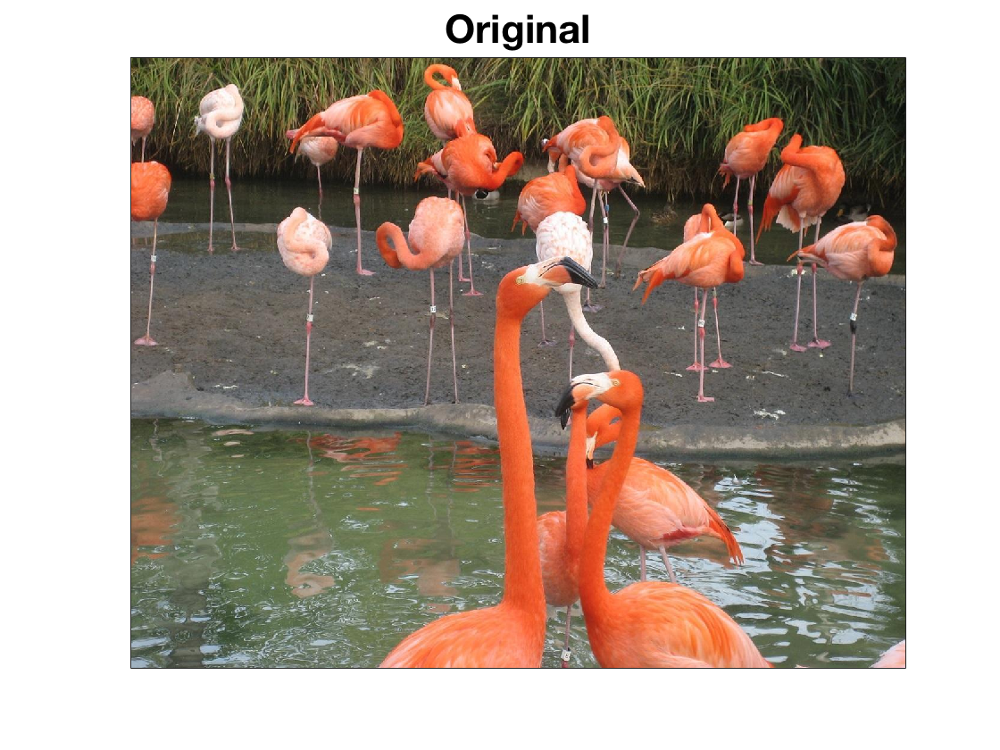
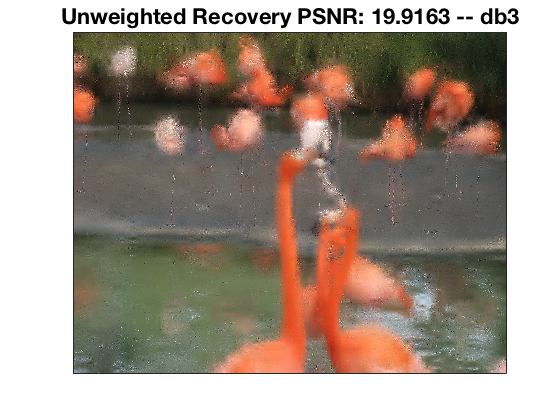
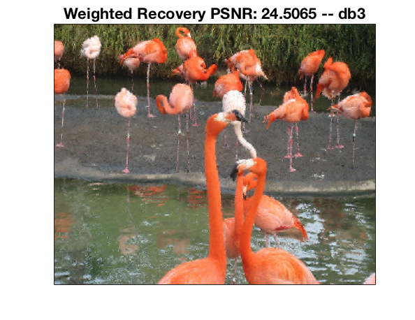
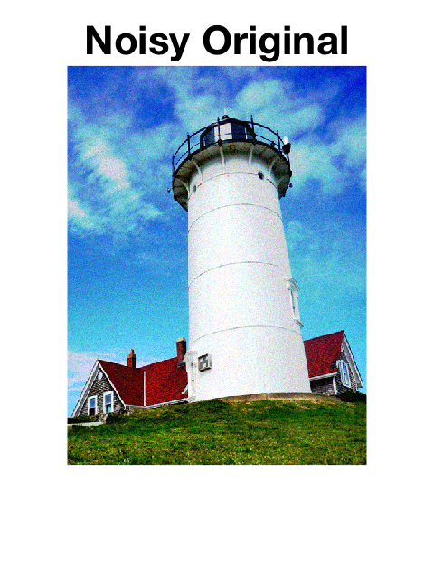
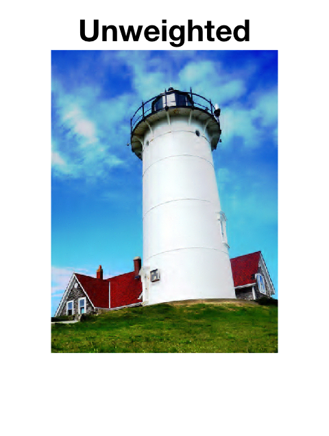
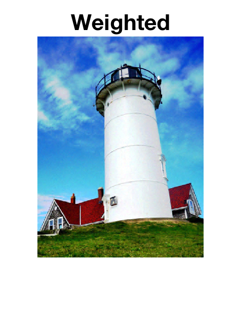

+++
title = "Image Processing and Optimization"
date = 2018-11-05T09:48:32-05:00
draft = false

# Tags: can be used for filtering projects.
# Example: `tags = ["optimization", "convex-optimization, "image-processing", "weighted"]`
tags = ["optimization","convex-optimization","image-processing"]

# Project summary to display on homepage.
summary = "Using weighted convex minimization to solve the image inpainting and de-noising problems."

# Optional external URL for project (replaces project detail page).
external_link = ""

# Featured image
# To use, add an image named `featured.jpg/png` to your page's folder. 
[image]
  # Caption (optional)
  caption = "An Interesting Real-World Photo"

  # Focal point (optional)
  # Options: Smart, Center, TopLeft, Top, TopRight, Left, Right, BottomLeft, Bottom, BottomRight
  focal_point = "Smart"
+++

# Weighted $\ell\_1$-minimization

In an upcoming work a convex optimization approach, 
based on weighted $\ell\_1$-regularization, is proposed
for reconstructing sparse wavelet representations. 
We show our proposed optimization problem
is effective for solving the signal/image inpainting and denoising problems.
We take the funcational representation of an image or signal to be
$$ f(y) = \sum\_{j \in \mathcal{J}} c\_j \Psi\_j(y) . $$
The wavelet coefficients $c = (c\_j)\_{j \in \mathcal{J}}$ 
associated to the functional representation of the 
object of interest are obtained as minizers of  
$$ \min\_{c \in \mathbb{R}^N} \lVert c \rVert\_{\omega,1} + \lVert Ac - f \rVert\_2, $$
where $f \in \mathbb{R}$ is either a vector $m$ subsamples or $m$ 
noisy observations.  
We show that by choosing the weights to be the uniform norms of the wavelet functions,
i.e., the $L^\infty$-norm of $\Psi\_j$,
the support of the recovered vector of coefficients forms a particular kind of index set, 
a closed tree.

*An example of a closed tree. The solid edges form the closed tree.*

This kind of index set is consistent with the behavior of many real-world signals and 
images and therefore our approach applies to a wide class of signals. 
Furthermore, the numerical examples below show the effectiveness 
of weighted $\ell\_1$-minimization. In addition, we have shown 
that the sample complexity associated with the weighted 
$\ell\_1$-regularized problem is smaller than the sample complexity 
of the unweighted problem. This analysis will appear in an upcoming paper.

## Image Inpainting

Compare the recovery of a picture of flamingos using unweighted and weighted 
$\ell\_1$-minimization from a random sample of $8\%$ of the pixels.
The original image is a $972 \times 1296$ pixel image. We used the 
[Daubechies 3](https://wikipedia.org/wiki/daubechies_wavelet) _db3_ basis.

 

## Image De-noising

The weighted $\ell\_1$-minimization problem can also be used to de-noise an image:

